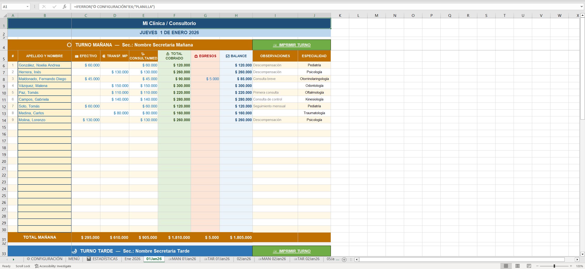
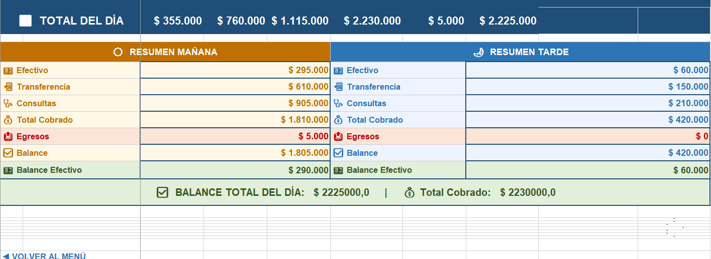
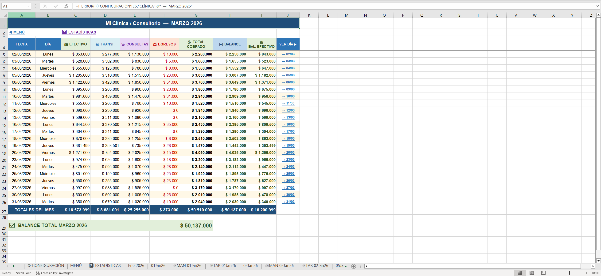
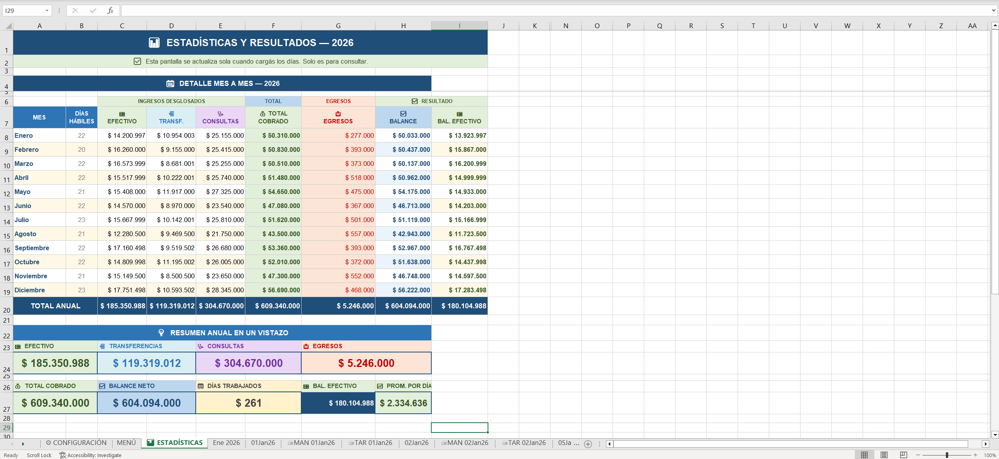
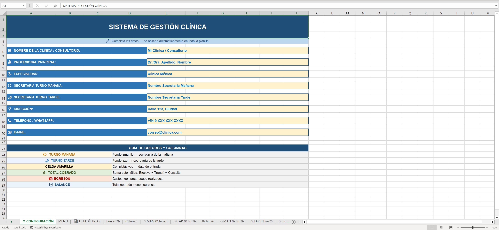
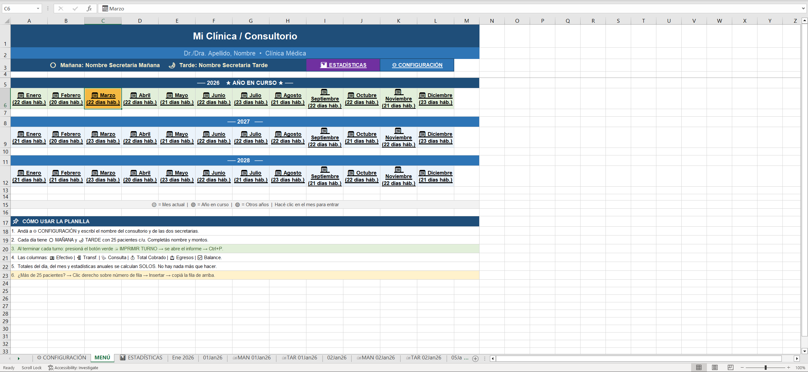

# 🏥 Medical Clinic Management System

> **Professional Excel-based Management System for Medical Clinics**  
> Complete patient tracking, appointment scheduling, and financial management solution with automated calculations and dynamic dashboards.

[](https://www.microsoft.com/en-us/microsoft-365/excel)
[](LICENSE)

---

## 📋 Table of Contents

- [Overview](#-overview)
- [Key Features](#-key-features)
- [System Architecture](#-system-architecture)
- [Worksheets Explained](#-worksheets-explained)
- [Formulas & Automation](#-formulas--automation)
- [Screenshots](#-screenshots)
- [Data Structure](#-data-structure)
- [Usage Instructions](#-usage-instructions)
- [Technical Highlights](#-technical-highlights)

---

## 🎯 Overview

This Excel-based management system provides a comprehensive solution for medical clinics to efficiently manage:

- **Patient appointments** (Morning & Afternoon shifts)
- **Financial tracking** (Cash, transfers, and expenses)
- **Daily & monthly statistics**
- **Automated reporting** and balance calculations

The system includes **261 working days** pre-loaded with realistic demo data for the year **2026**, featuring **3,112 medical appointments**, making it instantly usable for demonstrations and portfolio presentations.

---

## ✨ Key Features

### 📅 **Dual-Shift Appointment System**
- Separate tracking for **Morning Shift** (6:00 - 13:00) and **Afternoon Shift** (14:00 - 20:00)
- Automatic patient numbering per shift
- 17 medical specialties supported

### 💰 **Complete Financial Management**
| Feature | Description |
|---------|-------------|
| **Cash Payments** | Track all cash transactions per appointment |
| **Digital Transfers** | Record MercadoPago and other digital payments |
| **Expense Tracking** | Monitor clinic expenses (supplies, commissions, etc.) |
| **Automatic Totals** | Real-time calculation of daily and monthly balances |

### 📊 **Automated Dashboards**
- Monthly summary sheets with aggregated statistics
- Visual indicators for daily performance
- Year-over-year comparison capability

### 🎨 **User-Friendly Interface**
- Emoji-enhanced navigation system
- Color-coded sections for quick identification
- Print-optimized layouts for each shift

---

## 🏗️ System Architecture

```
📁 CLINIC MANAGEMENT SYSTEM
│
├── ⚙️ CONFIGURACIÓN (Configuration)
│   ├── Medical specialties with pricing
│   ├── Clinic information
│   └── System settings
│
├── 📊 ESTADÍSTICAS (Statistics)
│   ├── Annual overview dashboard
│   └── Performance metrics
│
├── 📅 MENÚ (Main Menu)
│   └── Central navigation hub
│
├── 📆 Monthly Sheets (Ene 2026 - Dic 2026)
│   ├── Daily summary view
│   ├── Aggregated totals per month
│   └── Quick navigation to specific dates
│
└── 📄 Daily Sheets (DDMMMYY format)
    ├── Morning Shift (Rows 6-30)
    ├── Afternoon Shift (Rows 35-59)
    └── Daily Totals
```

---

## 📑 Worksheets Explained

### 1. **⚙️ CONFIGURACIÓN** (Configuration Sheet)
Centralized configuration for the entire system:

| Setting | Purpose |
|---------|---------|
| **Medical Specialties** | Predefined list of 17 specialties with associated prices |
| **Shift Configuration** | Morning and afternoon session settings |
| **Clinic Information** | Name, address, and contact details |

**Specialties included:**
- General Medicine (Clínica Médica): $40,000
- Cardiology: $50,000
- Pediatrics: $60,000
- Gynecology: $70,000
- Traumatology: $80,000
- Dermatology: $90,000
- Neurology: $100,000
- Ophthalmology: $110,000
- Nutrition: $120,000
- Psychology: $130,000
- Kinesiology: $140,000
- Dentistry: $150,000
- Oncology: $160,000
- Endocrinology: $170,000
- Otorhinolaryngology: $45,000
- Urology: $55,000
- Pulmonology: $65,000

---

### 2. **📆 Monthly Summary Sheets** (Ene 2026 - Dic 2026)
Each month has a dedicated sheet showing:
- Daily totals for all key metrics
- Automatic aggregation using cross-sheet formulas
- Navigation links to specific dates

**Formula example:**
```excel
=IFERROR('15Jan26'!J74,"")
```
This pulls the daily balance from the specific date sheet.

---

### 3. **📄 Daily Sheets** (DDMMMYY format: 01Jan26, 02Jan26, etc.)

Each daily sheet contains two complete shifts:

#### Column Structure

| Column | Header | Description | Data Type |
|--------|--------|-------------|-----------|
| **A** | # | Appointment number | Number |
| **B** | APELLIDO Y NOMBRE | Patient full name | Text |
| **C** | 💵 EFECTIVO | Cash payment amount | Currency |
| **D** | 📲 TRANSF. MP | Digital transfer amount | Currency |
| **E** | 🩺 CONSULTA/MED | Consultation price | Currency (Number) |
| **F** | 💰 TOTAL COBRADO | **Total collected** | Formula |
| **G** | 📤 EGRESOS | Expenses | Currency |
| **H** | ✅ BALANCE | **Net balance** | Formula |
| **I** | OBSERVACIONES | Notes/Observations | Text |
| **J** | ESPECIALIDAD | Medical specialty | Text |

#### Row Structure

| Rows | Content |
|------|---------|
| 1-4 | Header, date, navigation |
| 5 | Column headers - Morning Shift |
| **6-30** | **Morning appointments** (up to 25 patients) |
| 31 | **TOTAL MAÑANA** (Morning totals) |
| 33 | Afternoon shift header |
| 34 | Column headers - Afternoon Shift |
| **35-59** | **Afternoon appointments** (up to 25 patients) |
| 60 | **TOTAL TARDE** (Afternoon totals) |
| 62 | **TOTAL DEL DÍA** (Daily grand totals) |

---

## 🔢 Formulas & Automation

### 💰 Total Collected (Column F)
Automatically calculates the sum of all payment methods:

```excel
=IF(AND(C6="",D6="",E6=""),"",IFERROR(C6,0)+IFERROR(D6,0)+IFERROR(E6,0))
```

**Logic:**
- If all payment fields are empty → display blank
- Otherwise → sum Cash (C) + Transfer (D) + Consultation Price (E)
- IFERROR ensures blank cells are treated as 0

---

### ✅ Balance (Column H)
Calculates net balance after expenses:

```excel
=IF(F6="","",F6-IFERROR(G6,0))
```

**Logic:**
- If Total is blank → display blank
- Otherwise → Total Collected (F) minus Expenses (G)

---

### 📊 Daily Totals

**Morning Total (Row 31):**
```excel
=SUM(F6:F30)      ' Total collected morning
=F31-IFERROR(G31,0)  ' Net balance morning
```

**Afternoon Total (Row 60):**
```excel
=SUM(F35:F59)     ' Total collected afternoon
=F60-IFERROR(G60,0)   ' Net balance afternoon
```

**Daily Grand Total (Row 62):**
```excel
=SUM(F31,F60)     ' Sum of both shifts
```

---

## 📸 Screenshots

### 1. Main Menu Navigation

*Central navigation hub with emoji-enhanced interface providing quick access to all system features.*

---

### 2. Monthly Overview

*Monthly summary sheet showing aggregated daily data with automatic totals and navigation links to specific dates.*

---

### 3. Daily Appointment View

*Complete daily view showing date header, navigation controls, and the beginning of appointment records.*

---

### 4. Morning Shift Detail

*Detailed morning shift view with patient names, payment methods, consultation prices, and automatic totals calculation. The formulas in columns F and H automatically compute totals and balances.*

---

### 5. Afternoon Shift Detail

*Afternoon shift section showing the same structure as morning shift, maintaining consistency across the system.*

---

### 6. Statistics Dashboard

*Comprehensive statistics dashboard displaying annual performance metrics and clinic overview.*

---

## 💾 Data Structure

### Demo Data (Year 2026)

The system includes realistic demo data for portfolio presentation:

| Metric | Value |
|--------|-------|
| **Total Working Days** | 261 |
| **Total Appointments** | 3,112 |
| **Morning Appointments** | ~1,800 |
| **Afternoon Appointments** | ~1,300 |
| **Total Cash Revenue** | $185,350,988 |
| **Total Transfer Revenue** | $119,319,012 |
| **Total Expenses** | $5,246,000 |
| **Net Balance** | $299,424,000 |

### Data Generation Logic

**Appointment Distribution:**
- Weekdays: 4-15 appointments per day
- Saturdays: 0-4 appointments
- Sundays: 0-3 appointments

**Payment Methods:**
- 55% Cash payments
- 35% Digital transfers
- 10% Mixed payments

**Expense Distribution:**
- ~15% of appointments include expenses
- Expense range: $5,000 - $20,000

---

## 📖 Usage Instructions

### Getting Started

1. **Open the file:** `GestionClinica_FINAL.xlsx`
2. **Navigate:** Use the 📅 MENÚ sheet to access different months
3. **View Daily Data:** Click on any date to see detailed appointment records
4. **Track Finances:** Observe automatic calculations in the TOTAL COBRADO and BALANCE columns

### Adding New Appointments

1. Navigate to the specific date sheet
2. Find the next available row in either Morning (rows 6-30) or Afternoon (rows 35-59)
3. Enter:
   - Patient name (Column B)
   - Payment amounts (Columns C and/or D)
   - Consultation price (Column E)
   - Specialty (Column J)
   - Any notes (Column I)
4. **Total and Balance calculate automatically!**

### Adding Expenses

Enter expense amount in Column G (📤 EGRESOS) for any appointment. The Balance will automatically deduct this amount.

### Monthly Reports

Each month has a summary sheet (e.g., "Ene 2026") that aggregates all daily data automatically using cross-sheet references.

---

## 🛠️ Technical Highlights

### Excel Features Utilized

| Feature | Implementation |
|---------|---------------|
| **Cross-Sheet References** | Monthly totals pull from daily sheets |
| **Conditional Logic** | IF/AND formulas for blank cell handling |
| **Error Handling** | IFERROR ensures robust calculations |
| **Named Ranges** | Configuration sheet used for dropdowns |
| **Conditional Formatting** | Visual indicators for different sections |
| **Formula Arrays** | SUM across ranges for shift totals |

### Data Integrity Features

- **Automatic blank cell handling** - Prevents #VALUE! errors
- **Currency formatting** - Consistent ARS ($) display
- **Data validation** - Specialty dropdowns from config sheet
- **Print layouts** - Dedicated print-optimized sheets for each shift

---

## 📦 File Structure

```
Clinic-Management-System/
│
├── 📄 GestionClinica_FINAL.xlsx    # Main application file
├── 📄 README.md                     # This documentation
│
└── 📁 screenshots/                # Visual documentation
    ├── 01-menu-principal.png      # Main navigation
    ├── 02-vista-mes.png           # Monthly overview
    ├── 03-vista-dia.png           # Daily view
    ├── 04-turno-manana.png        # Morning shift
    ├── 05-turno-tarde.png         # Afternoon shift
    └── 06-estadisticas.png        # Statistics dashboard
```

---

## 📝 License

This project is available for educational and portfolio purposes.

---

## 👨‍💻 Author

**Portfolio Project** - Demonstrating advanced Excel capabilities including complex formulas, data management, and financial tracking systems.

**Key Skills Showcased:**
- Advanced Excel Formula Writing
- Cross-Sheet Data Management
- Financial Tracking & Reporting
- User Interface Design in Excel
- Data Validation & Integrity
- Automated Calculation Systems

---

> 💡 **Note:** This system demonstrates production-ready Excel automation suitable for real-world medical clinic management scenarios.
